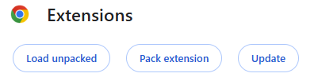
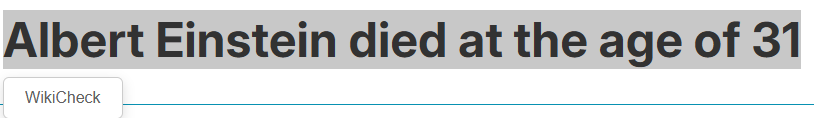
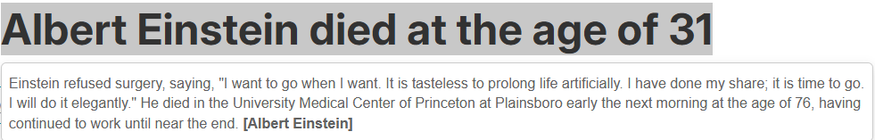
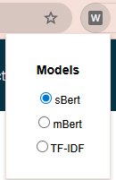

WikiCheck aims on providing users with an efficient tool for checking and searching for facts within the knowledge base of Wikipedia. The tool is specialized to accept queries and provide and display results from and for users with different language skills. It simply focuses on giving everyone the same opportunity to retrieve the same knowledge from one of the biggest knowledge bases of the modern internet.

# Project structure
For the backend of WikiCheck we use FastAPI and for the frontend Angular. In addition to the frontend, we also offer a chrome webextension, which might be the faster approach but has less functionality than the actual frontend.

## Frontend
As already mentioned, we used Angular for the frontend. All files for it can be found in the subfolder ***'./frontend'***.

## Backend
All of the backend files are located in the ***'./backend'*** folder and the code can be found in the file ***'./backend/main.py'***.

## Backend
The code for our chrome extension is located in the ***'./chrome-extension'*** folder and can be installed by following the steps in the installation instructions down below.


# Installation

## Backend
Choose **one** of the following methods:

### Option 1: Conda (recommended)
```bash
conda env create -f environment.yml
conda activate wikicheck
```
### Option 2: PIP without environment
```bash
pip install -r requirements.txt
```

## Start Backend
```bash
uvicorn main:app --reload
```

## Frontend

### Installation

```bash
npm install
```

## Start Frontend
```bash
ng serve
```

## Chrome Extension

### Installation

Go to extensions (***chrome://extensions/***) within your browser and click on ***Load unpacked*** and select the ***./chrome-extension*** folder.




### Usage

Just select a text within your browser and hit the displaying WikiCheck button.




Within the settings of the Chrome extension, you are also able to select a retrieval model/method.




# Evaluation

We already provided some references for the evaluation, which can be found in the file ***'./backend/eval.json'***. Feel free to expand or change the content of it. In order to evaluate, go to the frontend and click on evaluation. If you have expanded or edited the ***'./backend/eval.json'*** make sure to delete the ***'./backend/eval_results.json'***, in order to start another new evaluation.

# Dataset

We used the english wikipedia dataset ***wikimedia/wikipedia*** from Hugging Face (2023-11-01). It consists of english wikipedia articles, where each row is represents one wikipedia article.
Also, we decided to just use a subset of the dataset and defined its access to streaming mode, due to the huge size of it.
